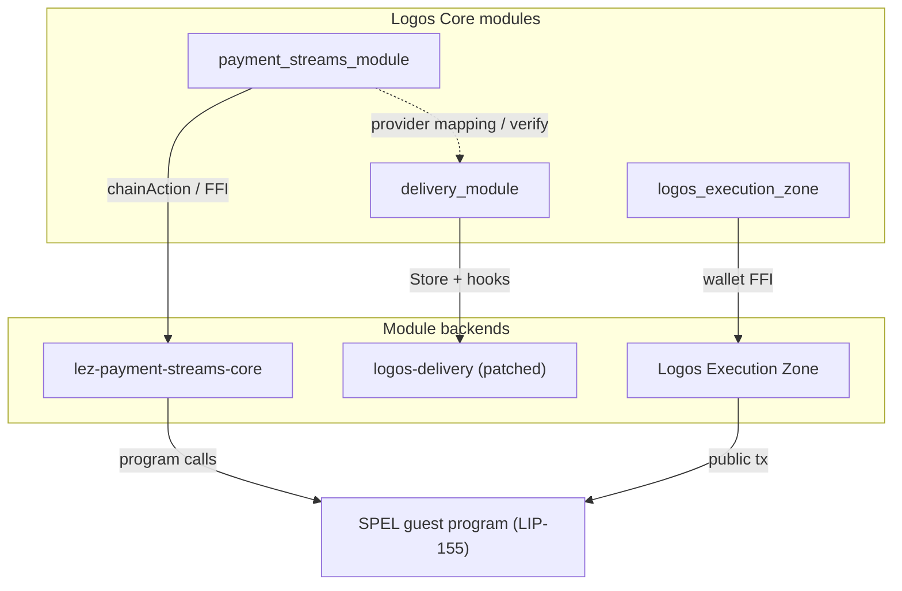
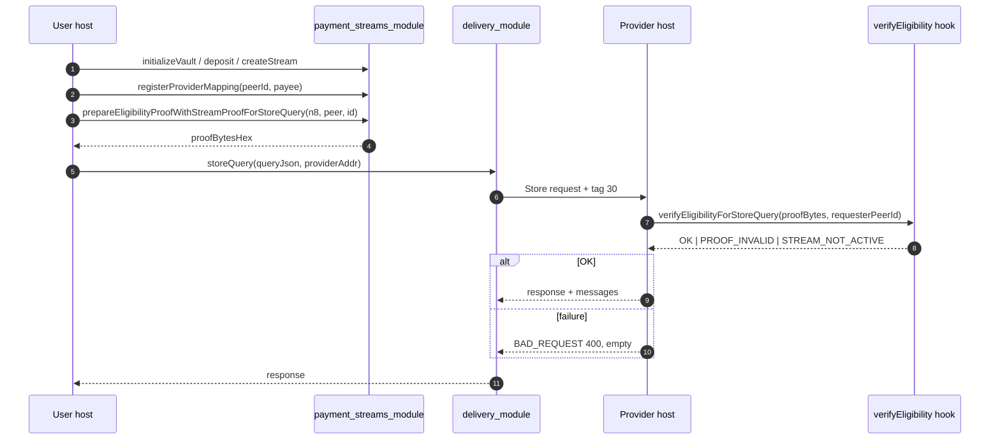

# Payment Streams

From LIP-155 to Working Integration

Two verification flows: module-only lifecycle and Store-integrated eligibility.

---

## What payment streams enable

Continuous micropayments with per-second granularity from an owner to a provider.

- Vaults — per-owner fund containers holding a set of streams
- Streams — directional channels with a rate and allocation
- Accrual — value flows to the provider every second the stream is active
- Pause / resume / top-up / claim — owner and provider lifecycle operations

---

## Implementation architecture



---

## User Journey

Direct stream operation via the Logos Core module. Single host, no Store.

```bash
MODE=module CHAIN=local ./scripts/e2e.sh local run
```

Artifact (`.scaffold/e2e/artifacts/module-e2e-*.log`):

```jsonl
{"phase":"vault_init","ok":true}
{"phase":"create_stream","ok":true}
{"phase":"topup_stream","ok":true}
{"phase":"claim","ok":true}
{"phase":"module_e2e_complete","ok":true}
```

Phases:

| Phase | localnet | testnet v0.2 |
| --- | --- | --- |
| vault / stream / lifecycle / claim | done | planned |

---

## Developer Journey

Store integration with LIP-155 eligibility proofs. Dual host.

RFC 73 wire format (Store tag `30`):

- Request carries opaque `EligibilityProof` bytes
- Response carries nested `eligibility_status` (code + desc)
- Failure: `BAD_REQUEST` (400), empty messages, verdict in tag `30`
- Codes: `OK`, `PARAMS_REJECTED`, `PROOF_INVALID`, `STREAM_NOT_ACTIVE`

```bash
./scripts/e2e.sh local run
```

Phases:

| Phase | localnet | testnet v0.2 |
| --- | --- | --- |
| store_query_success | done | planned |
| store_query_missing_proof | done | planned |
| claim | done | planned |

---

## Developer Journey — sequence



---

## Documentation deliverables

| | User Journey | Developer Journey |
| --- | --- | --- |
| File | `USER_JOURNEY.md` | `DEVELOPER_JOURNEY.md` |
| Audience | end users operating streams | integrators building paid services |
| Hosts | single | dual (user + provider) |
| Modules | `logos_execution_zone`, `payment_streams_module` | + `delivery_module` |
| Mode | `MODE=module` | `MODE=store` |
| localnet | done | done |
| testnet v0.2 | planned | planned |

---

## Current status

| Milestone | Status |
| --- | --- |
| LIP-155 spec (on-chain part) | done |
| SPEL guest program | done |
| `payment_streams_module` — chainAction, prepare, verify | done |
| Delivery fork — Store + eligibility hooks | done |
| User and Developer Journeys verified on localnet | done |
| Testnet v0.2 deployment (LEZ rc5 pin) | in progress |
| User and Developer Journeys on testnet v0.2 | planned post-deployment |

---

## Summary

One protocol, two patterns.

- On-chain program — LIP-155 rules in the SPEL guest
- Core module — `payment_streams_module` exposes rules as `chainAction` and proof methods
- Integration hooks — `delivery_module` + RFC 73 wire format bring eligibility to paid services

```bash
MODE=module CHAIN=local ./scripts/e2e.sh local run   # User Journey
./scripts/e2e.sh local run                             # Developer Journey
```
