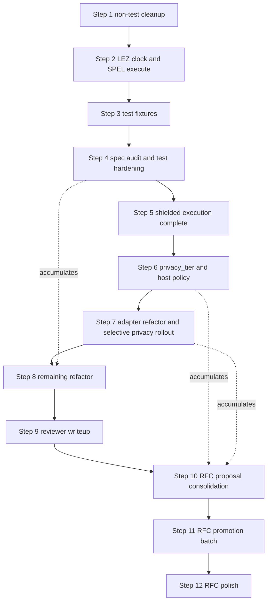

# Payment Streams on LEZ - Implementation Plan

This plan covers the SPEL-based LEZ implementation
for payment streams,
as defined in
`rfc-index/docs/ift-ts/raw/payment-streams.md`.

Implementation decisions are tracked in
`lez-payment-streams/design.md`.
RFC promotion is deferred
until decisions are stable.

## Scope

- Production implementation repository.
- Includes account model,
instruction handlers,
validation rules,
and tests.
- Vault semantics are single-token (native).
- Off-chain protocol work is out of scope.

## References

- `rfc-index/docs/ift-ts/raw/payment-streams.md` — protocol semantics.
- `lez-payment-streams/design.md` — implementation decision log.
- logos-execution-zone PR 403 `https://github.com/logos-blockchain/logos-execution-zone/pull/403` — system clock accounts.
- `spel/` — SPEL framework and macros.
- SPEL PR 126 `https://github.com/logos-co/spel/pull/126` — unified `SpelOutput::execute()` (auto-claim from account attributes); deprecates `states_only` / `with_chained_calls`.
- `lez-book/` — LEZ Development Guide (mdBook).

## Plan Execution Policy

Before editing the active implementation step,
record or update relevant implementation decisions in
`lez-payment-streams/design.md`.
Only the active step should receive concrete amendments.
Promote decisions to
`rfc-index/docs/ift-ts/raw/payment-streams.md`
in explicit batches.
Multi-token support is a future extension.

## Testing Approach

Use in-process `V03State` tests
with a TDD loop:
start with failing tests,
implement,
rerun to green.
That workflow does not depend on a particular `cargo test` filter
or a separate test binary.

Primary local loop:

- `RISC0_DEV_MODE=1 cargo test -p lez_payment_streams_core --lib`

Optional: add a `program_tests` filter
(`… --lib program_tests`)
to match only tests under that module
when you want a slightly faster iteration
and are not touching other unit tests.

After changes to the guest
or to shared types the guest uses,
rebuild the guest ELF before relying on test results,
for example
`cargo risczero build --manifest-path methods/guest/Cargo.toml`
or
`cargo build -p lez_payment_streams-methods`.

Keep Borsh guest-safe:
on guest, avoid `#[derive(BorshSerialize, BorshDeserialize)]`—
use manual serialization.
Shared types are guest-relevant,
so direct derive-based Borsh in shared code isn't expected.

## Code Placement in SPEL Repository

- `methods/guest/src/bin/lez_payment_streams.rs`
  contains the `#[lez_program]` module,
  `#[instruction]` handlers,
  account attributes,
  and thin dispatch glue.
- `lez_payment_streams_core/src/lib.rs`
  is the shared types and pure-logic boundary
  for both guest and host code.
  Keep `VaultConfig`, `VaultHolding`, `StreamConfig`,
  shared enums, instruction payload types,
  and pure helpers here.
  Avoid guest runtime or account I/O here.
- `methods/src/lib.rs`
  remains generated-methods glue
  and should stay minimal.
- `lez_payment_streams_core/src/program_tests/`
  contains guest-backed `V03State` tests
  (submodules per instruction, plus `serialization` and `common` helpers).
- `lez_payment_streams_core/src/test_helpers.rs`
  contains reusable test harness helpers
  for keypairs,
  state setup,
  guest deployment,
  and transaction builders.

Negative-case tests use a `*_fails` suffix
when the name alone would be ambiguous
(for example `test_withdraw_exceeds_unallocated_fails`).

## Completed Work

Reference summary of work already landed.
Decision bullets for each item are recorded in `design.md`.

- SPEL scaffold and vault baseline:
  `VaultConfig` and `VaultHolding` payloads with manual `to_bytes` / `from_bytes`,
  `initialize_vault` handler with PDA-derived vault accounts.
- Deposit and withdraw:
  `deposit` and `withdraw` handlers,
  unallocated-balance rule (`vault_holding.balance - total_allocated`),
  owner authorization.
- Stream creation:
  `StreamConfig` payload,
  `create_stream` handler with stream PDA,
  stream id assignment policy.
- Timestamp and accrual:
  mock timestamp account,
  lazy accrual via `StreamConfig::at_time` in shared core,
  `sync_stream` handler,
  `StreamConfig::validate_invariants`,
  pause-on-depletion,
  depletion-instant handling for `accrued_as_of`.
- Pause, resume, top-up handlers with legal-transition enforcement.
- Close stream with unaccrued return.
- Claim with state-dependent semantics.
- Systematic negative tests and invariants:
  wrong caller, invalid transitions, overflow or underflow,
  operations on non-existent accounts.

## Plan

Numbered steps below replace the remaining work.
Steps are listed in execution order.

### Ordering overview

### 1. Non-test cleanup

Mechanical, low-risk, preserves external surface.
Touches core and guest only.

- `cargo fmt --all`.
- `cargo clippy --workspace --all-targets`,
  apply only mechanical fixes
  (unused imports, needless clones, redundant closures).
- Extract the repeated prologue in
  `methods/guest/src/bin/lez_payment_streams.rs`
  shared by `close_stream`, `claim`, and `top_up_stream`.
  Shape: two or three variants keyed on auth rule
  (owner-signed, authority-signed, provider-signed),
  reusing or generalizing the existing `load_vault_stream_and_clock`.
- Add a small post-state constructor helper
  (for example `states_only_5(vault_config, holding, stream, signer, clock)`).

Do not touch in this step:
public names on `VaultConfig`, `VaultHolding`, `StreamConfig`, `Instruction`, `ERR_*`;
core math signatures
(`at_time`, `close_at_time`, `claim_at_time`, `resume_from_paused_at`, `validate_invariants`);
module boundaries;
`assert_execution_failed_with_code` semantics.

### 2. LEZ upgrade, clock migration, and SPEL `execute` migration

Retire `lez_payment_streams_core/src/mock_timestamp.rs`
and all `MockTimestamp` references
in favor of the system clock accounts from
logos-execution-zone PR 403
(`CLOCK_01`, `CLOCK_10`, `CLOCK_50`; 16-byte `(block_id, timestamp)` payload).

In the same dependency bump,
migrate the guest from deprecated `SpelOutput::states_only` / `with_chained_calls`
to `SpelOutput::execute` (SPEL PR 126):
one pinned SPEL revision across `methods/guest`, `lez_payment_streams_core`, and `examples`,
verified together with the LEZ/NSSA upgrade.

Decision log updates in `design.md`:

- system clock accounts supersede `MockTimestamp`
- clock granularity policy (guest accepts any of the three; client picks)
- retirement of `ERR_INVALID_MOCK_TIMESTAMP` and `SEED_MOCK_CLOCK`
- private-proof invalidation rationale for coarser clocks
- SPEL `execute` migration and pinned SPEL git revision (PR 126 included in the pin)

#### 2.1 Upgrade LEZ, NSSA, and SPEL dependencies

- Bump the LEZ and NSSA dependencies
  to a revision that includes PR 403 merged.
- Bump SPEL (`spel-framework`, `spel-framework-core`, and any other SPEL crates in the workspace)
  to a git revision that includes PR 126 merged (`SpelOutput::execute`).
  Pin the same `rev` on every SPEL git dependency so macros and core stay aligned.
- Resolve versions so the chosen SPEL revision is compatible with the chosen LEZ/NSSA stack;
  if a single combination fails CI, adjust pins or split only as a last resort.
- Verify in the resolved version:
  - `V03State::new_with_genesis_accounts` seeds the three clock accounts.
  - `CLOCK_01_ID`, `CLOCK_10_ID`, `CLOCK_50_ID` (or equivalents)
    are exported and reachable from guest and host.
  - The clock program id is reachable for ownership checks.
- Smoke test: existing suite still passes after the bump
  (build the guest, then run
  `RISC0_DEV_MODE=1 cargo test -p lez_payment_streams_core --lib`).
  Fix any upstream breakage in isolation before starting the rest of the migration.

#### 2.2 Guest and core changes

- Delete `MockTimestamp` or shrink it to a test-only payload constructor
  (`fn clock_payload(block_id: u64, timestamp: u64) -> Vec<u8>`).
- Migrate guest handlers from `SpelOutput::states_only` / `with_chained_calls`
  to `SpelOutput::execute` per SPEL PR 126;
  refactor or remove `states_only_five_owner_stream_sync_layout`
  so the guest uses the unified API (macro-generated claims) end to end.
- In `methods/guest/src/bin/lez_payment_streams.rs`,
  replace `parse_mock_timestamp` with `parse_clock_account`
  that reads the 16-byte `(block_id, timestamp)` layout
  and returns the `timestamp` as `Timestamp`.
- Add clock identity validation inside `parse_clock_account`.
  Pick one of:
  - owner check against the clock program id
    (`account.program_owner == CLOCK_PROGRAM_ID`), or
  - allowlist against the three system clock account ids.
  Emit a new error code `ERR_INVALID_CLOCK_ACCOUNT`
  (append after 6025; do not renumber existing codes).
- Retire `ERR_INVALID_MOCK_TIMESTAMP` (6011).
  Leave the constant reserved and unused.
- `StreamConfig::at_time` and the other math in
  `lez_payment_streams_core/src/stream_config.rs`
  stay unchanged.
- Do not alter `Instruction` variants in this step.
  Client chooses clock granularity
  by which clock account id it includes in `account_ids`.

Note (clock types in core).
`lez_payment_streams_core/src/clock_wire.rs` duplicates the system clock
`AccountId` constants and `ClockAccountData` Borsh layout from LEZ `clock_core`
instead of depending on that crate,
to avoid Cargo friction (guest vs host workspaces, git pins, and patch rules)
while the LEZ and SPEL stack was aligned.
Revisit in step 8 (or earlier if the graph simplifies)
and prefer a direct `clock_core` dependency from the same LEZ `rev`/`tag` as `nssa_core`
so definitions stay synchronized with upstream.

Note (test PDA helpers).
`lez_payment_streams_core/src/test_pda.rs` mirrors the seed combination rules from
`spel-framework-core::pda` (`seed_from_str`, multi-seed hashing, then `PdaSeed` /
`AccountId` via `nssa_core`).
It does not reimplement NSSA’s PDA-to-id mapping.
The duplication avoids adding `spel-framework-core` as a dev-dependency on
`lez_payment_streams_core`, which would pull a second `nssa_core` revision
(SPEL’s LEZ pin) and break type identity with the crate’s main `nssa_core` dep.
Revisit in step 8 (or with step 3 fixture work) and drop `test_pda.rs` once SPEL and LEZ
pins guarantee a single `nssa_core` in the test graph.

#### 2.3 Test harness changes

- Replace `force_mock_timestamp_account` in
  `lez_payment_streams_core/src/test_helpers.rs`
  with `force_clock_account(state, clock_id, block_id, timestamp)` that:
  - writes the 16-byte payload,
  - sets `program_owner` to the clock program id
    so the guest identity check passes.
- In `lez_payment_streams_core/src/harness_seeds.rs`,
  retire `SEED_MOCK_CLOCK`
  and add constants or helpers that surface
  the three system clock account ids.
- Update `lez_payment_streams_core/src/program_tests/common.rs`
  fixtures (`state_deposited_with_clock*`)
  to take a clock account id from the system clocks,
  not a keypair-derived id.
- Tests should bind the harness clock as `clock_account_id`
  (and clock timestamps as `clock_initial_ts`, etc.),
  not legacy “mock clock” local names.

#### 2.4 Design doc and proposal list updates

- In `design.md`,
  replace the "placeholder timestamp source account" paragraph under Data types
  with a section describing the system clock accounts,
  the 16-byte layout,
  granularity trade-offs,
  and the guest-side identity check.
- Add entries to the RFC-proposal list (seed for step 10):
  replace "mock timestamp source" wording with system clocks;
  document the granularity trade-off
  in Security and Privacy Considerations.

### 3. Test fixture extraction

Runs over migrated code so helpers are keyed on the new clock reality.

- Introduce a `VaultFixture` struct returned by `state_with_initialized_vault*`
  (replacing the 7-tuple destructuring) with fields
  `state`, `program_id`, `owner_key`, `owner_id`,
  `vault_id`, `vault_config`, `vault_holding`.
  Add `provider` and `clock_id` where fixtures provide them.
- Add a scenario builder for
  "vault initialized, deposit made, clock set, stream created,
  clock advanced, synced at `t1`".
  The three tests in
  `lez_payment_streams_core/src/program_tests/claim.rs`
  collapse down to the differing tail after this helper lands.
- Generalize `first_stream_accounts` so it builds `StreamIxAccounts`
  directly from a `VaultFixture` plus stream PDA.
- Consolidate per-test constants (`allocation`, `rate`, `t0`, `t1`)
  that three or more tests in the same module share,
  promoted to module-level `const`s.
- Sort and deduplicate `use` blocks across test modules.

### 4. Spec audit and test hardening

Walk `rfc-index/docs/ift-ts/raw/payment-streams.md`
and `design.md` against the code.
Produce a running three-bucket list during the audit:

1. missing or weak tests (add in place),
2. behavior gaps (fix in place, minimal change),
3. RFC-proposal candidates (append to the step 10 list).

Specific items to check that are not fully covered today:

- Solvency and conservation invariants as scenario tests:
  `vault_holding.balance >= vault_config.total_allocated` and
  `total_allocated == Σ stream.allocation` after arbitrary legal sequences.
- Arithmetic boundaries at `u128::MAX`, `u64::MAX`, `Timestamp::MAX`,
  `next_stream_id` overflow, `total_allocated` overflow,
  stream `allocation` overflow on top-up.
- Authorization matrix: one wrong-signer negative case per instruction.
  Consider a parameterized module.
- `sync_stream` edge cases:
  `now == accrued_as_of` is a no-op fold;
  depletion via sync;
  time regression fails.
- Withdraw recipient existence precondition,
  parallel to the documented provider-account precondition on claim.
- Deterministic PDA derivation test that asserts the host helper
  in `lez_payment_streams_core/src/test_helpers.rs`
  matches the guest `#[account(pda = [...])]` seed declarations.
- Clock harness hygiene:
  monotonic-by-default helpers
  and an explicit escape hatch for negative tests,
  forward from the earlier mock-clock follow-up,
  now keyed on the system clock.

### 5. Shielded execution tests

Shielded-mode tests now cover representative flows through
`execute_and_prove`
and
`transition_from_privacy_preserving_transaction`
under the current account model.
No protocol redesign happened in this step.

Benefits from step 2 because the system clock
matches the private-proof invalidation model that PR 403 was designed around.

Decision log updates in `design.md`:

- public and shielded parity assumptions
- timestamp constraints in private flow
  (clock granularity choice per instruction)

Normative detail for NSSA visibility, PP transition rules,
the `withdraw` claim metadata change,
and deposit PP limitations is recorded under
Privacy-preserving execution (NSSA) and step 5 tests
in `design.md`.

RFC-level privacy goals,
how the current guest contradicts them,
and protocol directions beyond step 5
are spelled out in the section
Transition to private execution
after the numbered Plan steps.

### 6. privacy_tier and host policy

Goal:
keep the current protocol semantics and math,
while persisting an explicit `privacy_tier` on `VaultConfig`
and documenting a realistic pseudonymous unlinkability story.

Introduce `privacy_tier` at vault creation time (immutable for life).
The stored tier is a small discriminant with labels for product and docs,
not a consensus-enforced PP gate.

- `Public`:
  may execute via public or PP transactions.
  No owner-funding unlinkability guarantee.
- `PseudonymousFunder`:
  intended for PP-only lifecycle
  (vault and stream instructions) under our host or wallet.
  The unlinkability target is primary public funder key
  versus vault and stream activity,
  not hiding that a vault has a controller `AccountId` on-chain.

#### Chosen MVP approach (implementation target)

- `VaultConfig.owner` remains the authorization anchor.
  Operationally it should be a dedicated private-account `AccountId`
  (npk-derived in the LEZ sense), not the user’s main public wallet id,
  when unlinkability from that main key matters.
- Authorization in guest code stays the same shape:
  `owner.account_id` must match `VaultConfig.owner`
  and owner-gated instructions keep `#[account(signer)]`.
  Under PP, control of a `PrivateOwned` owner row
  is established by the wallet and NSSA witness material,
  not by “the same mechanical public tx signature,”
  but the guest still checks the same equality as today.
- Funding discipline:
  users should pre-shield spendable balance
  before funding a `PseudonymousFunder` vault,
  then use PP-shaped flows so liquidity enters `VaultHolding`
  without a public leg that debits a doxxed public account
  in the same correlation surface as the vault.
  A public shielding hop from Alice’s public account
  still creates Alice → private persona;
  delay and hygiene reduce naive timing correlation only.
- `vault_config` row visibility:
  if the config account stays a public row in mixed PP,
  `VaultConfig.owner` bytes remain observer-visible
  as a persistent pseudonym,
  not “secret owner metadata.”
  Unlinkability is therefore pseudonymity relative to the main funder key,
  given no on-chain bridge between them.

#### Where enforcement lives (pinned NSSA and LEZ fact)

On the pinned stack,
the inner program guest receives only
`program_id`, `caller_program_id`, `pre_states`, and `instruction_data`
via `Program::write_inputs`.
It does not receive the visibility mask;
that mask is an input to the outer privacy-preserving circuit only.

Therefore:

- PP-only for `PseudonymousFunder` vaults is enforced by our host or wallet
  (refuse to build or submit public transitions that touch those vaults),
  and by tests that assert that behavior for our harness.
- The application guest must not be described as enforcing
  “public vs PP execution mode,”
  because it has no trustworthy execution-mode signal in its input env.
- The guest still stores and checks `privacy_tier` in `VaultConfig`
  for on-chain semantic rules
  (for example immutability, or invariants that depend on tier),
  not for detecting PP.

#### What we do not claim without further platform work

- We do not guarantee that arbitrary third-party submitters
  cannot attempt a public path:
  that would require consensus-level rules
  (for example a generic account or program policy hook in NSSA),
  not payment-streams guest logic alone.

Implementation work:

- Extend `VaultConfig` with a `privacy_tier` field (`Public` or `PseudonymousFunder`).
- Thread `privacy_tier` through initialization and validation helpers.
- Guest: tier-aware checks only where derivable from state bytes
  (not from execution mode).
- Host or test harness:
  refuse public transitions for `PseudonymousFunder` vault fixtures;
  document the same policy for product wallets.
- Add positive PP tests for PseudonymousFunder-tier flows
  (and extend fixtures for private-owner personas where needed).
- Add negative harness tests that a public transition attempt
  for a `PseudonymousFunder` vault is rejected before or without
  committing the unwanted linkage policy
  (exact hook depends on where the harness can intercept).

Decision log updates in `design.md`:

- exact `privacy_tier` semantics and immutability
- privacy guarantee scope:
  pseudonymous controller,
  pre-shield and PP-only operational requirements,
  first-hop shielding caveat
- guest vs host vs (optional future) consensus enforcement boundaries,
  citing inner-program inputs vs outer-circuit `visibility_mask`

### 7. Adapter refactor and selective privacy rollout

Goal:
maximize reuse of business logic
while separating host transaction construction
from guest state transition code.

Refactor shape:

- Keep stream math,
  lifecycle transitions,
  and invariants in shared core.
- Keep guest handlers thin:
  parse pre-state,
  apply state-derived `privacy_tier` rules only,
  invoke shared helpers,
  serialize post-state.
- Centralize fixture and harness helpers that build PP account lists,
  visibility masks,
  and witness inputs for `PseudonymousFunder` vault scenarios
  (including private-owner rows where tests require them).
- Introduce small adapter helpers for account parsing and output assembly
  where it reduces duplication without hiding execution-mode facts
  inside the guest.
- Avoid duplicated accrual or conservation logic across modes.

Selective privacy rollout under current account model:

- `PseudonymousFunder` tier:
  our host or wallet enforces PP-only interaction;
  guest remains agnostic to public versus PP envelope.
- `Public` tier:
  public and PP execution remain allowed.
  PP can provide selective confidentiality
  but does not imply owner-funding unlinkability
  if the vault was created or funded on a public path.
- Stream-vault linkage remains visible in the current PDA model.
  This step does not attempt commitment-native custody.

### 8. Remaining refactor

With public,
shielded,
and `privacy_tier` policy suites green,
reshape where audit findings and reviewer perspective now justify it.

Candidates not resolved in earlier steps:

- Replace `lez_payment_streams_core/src/clock_wire.rs` with a dependency on LEZ
  `clock_core` (same git `rev`/`tag` as `nssa_core`) once pins and workspaces allow,
  removing duplicated clock ids and `ClockAccountData` layout.
- Remove `lez_payment_streams_core/src/test_pda.rs` in favor of
  `spel-framework-core::pda` (or equivalent) in tests once dev-dependencies resolve to
  exactly one `nssa_core`, so host PDA helpers cannot drift from SPEL.
- Collapse contextual `spel_custom(code, "message")` call sites via a small helper
  (design informed by the full call-site set after step 4).
- Decide `ERR_*` as `#[repr(u32)]` enum vs keep `u32` constants,
  gated on whether tests actually match on many codes.
- Error code gaps (e.g. legacy reserved numbers no longer emitted):
  either keep them documented as permanently reserved in `design.md`,
  or plan a single breaking renumbering pass that produces a dense `6001..` table
  and updates every consumer that matches on numeric codes
  (not mixed with feature work; treat as an explicit compatibility event).
- Any public-name renames on types or fields,
  applied in a single sweep together with the reviewer doc in step 9.
- Unused imports: run the clippy/unused-import pass workspace-wide,
  tighten explicit `use` lists,
  and remove blanket allows that only exist to hide them
  (for example `#[allow(unused_imports)]` on the guest program module).
- Final `cargo fmt` and
  `cargo clippy --workspace --all-targets`
  sweep before handoff.

### 9. Reviewer-facing writeup

Replace or reshape `design.md`
into a reviewer-oriented document.
Suggested structure:

1. Component map (core, guest, methods glue).
2. Account model and PDA derivation, inline table.
3. Wire layouts per account (byte offsets), including the system clock.
4. Authorization matrix, instruction by signer.
5. Invariants and balance conservation.
6. Accrual semantics and depletion instant.
7. Error code table with call sites.
8. Testing guide (how to run, fixtures, seeds).
9. Divergences from the RFC,
   pointing to the step 10 proposal list.

### 10. RFC proposal consolidation

Clean the RFC-proposal list accumulated in steps 2 through 9.
Deliverable: a patch-ready diff against
`rfc-index/docs/ift-ts/raw/payment-streams.md`
plus a rationale paragraph per change.

Known seeds:

- `unallocated` terminology
  (replace any lingering "available balance" wording).
- `allocation` as current commitment (`accrued + unaccrued`).
- `resume` wording around `unaccrued`
  (resume requires `accrued < allocation`).
- Equivalence criterion: streams match when
  `allocation`, `accrued`, `rate`, and `state` match,
  not when "original create amount" matches.
- Claim reduces `allocation` and `total_allocated` by the payout,
  not only `VaultHolding` balance and `accrued`.
- System clock replaces the mock timestamp source;
  granularity guidance added to Security and Privacy Considerations.

Additional seeds from steps 6 and 7:

- explicit `privacy_tier` (`Public`, `PseudonymousFunder`) and immutability for life
- user-facing privacy contract:
  pseudonymous `VaultConfig.owner` (typically private-account id),
  pre-shield funding hygiene,
  PP-only operation for `PseudonymousFunder` vaults on our host or wallet
- guest vs host vs consensus enforcement:
  inner program does not receive `visibility_mask`;
  PP-only policy is host or wallet enforced unless a future generic NSSA hook exists
- honest caveats:
  public `vault_config` row still exposes `owner` bytes;
  public shielding hop links funder to private persona;
  LEZ proofs do not assert “never funded from public key Alice”
- selective confidentiality language for PP on `Public`-tier vaults

Do not edit the RFC in this step.

### 11. RFC promotion batch

Apply the consolidated patch from step 10 in one batch to
`rfc-index/docs/ift-ts/raw/payment-streams.md`.
This is the first step that edits the RFC.

Include:

- account model and PDA derivation
- instruction definitions
- validation and invariant rules
- time source (system clocks) and accrual behavior
- execution mode notes

### 12. RFC polish and review

Finalize Security and Privacy Considerations
and References in the RFC.
Review consistency across:
implemented behavior,
`design.md` (or its successor reviewer doc),
and RFC text.

## Transition to private execution

This section ties the payment-streams RFC privacy posture
to the present SPEL guest and NSSA PP model.
It supersedes the earlier step 5 privacy-evolution bullets.

### What one code path means in practice

The phrase
write guest logic once and execute publicly or privately
means business logic reuse,
not identical privacy or visibility outcomes.

Shared across public and private execution:

- accrual and balance math
- lifecycle state transitions
- authorization predicates over plaintext state inside the zkVM
  (`AccountWithMetadata`, `VaultConfig.owner`, and so on)

Potentially different between execution contexts:

- account visibility and witness material outside the inner program
- what linkage an external observer can infer from on-chain artifacts
- how post-state is represented in public versus encrypted rows

### NSSA split: inner program vs outer privacy circuit

On the pinned stack,
application program execution (including SPEL guests)
is proven with inputs written by `Program::write_inputs`:
program id, optional caller id, `pre_states`, instruction words.

The visibility mask is supplied only to the outer
privacy-preserving circuit input (`PrivacyPreservingCircuitInput`),
together with program outputs and private-account key material.

So the payment-streams guest cannot branch on the mask
or reliably infer “this run was submitted as PP versus public”
from its executor input envelope alone.

### Why PDAs and public rows still matter for linkage

In the current account model,
vault and stream identities are PDA-derived
from seeds and program id.
Observers can always rebuild vault ↔ stream structure
from public account ids and updates.

What we target for the MVP is narrower:

- break or avoid primary public funder key ↔ vault activity
  when the user follows the PseudonymousFunder-tier playbook below.

PP mixed visibility can hide some legs (for example payouts),
but does not erase a public `vault_config` row
that still carries plaintext `VaultConfig` bytes including `owner`.

### Chosen MVP direction (what we implement)

#### privacy_tier values

- `Public`:
  same as today for public-first workflows.
  PP remains allowed for selective confidentiality;
  it does not retroactively hide a public funder link.
- `PseudonymousFunder`:
  operational PP-only policy under our host or wallet,
  plus funding hygiene described below.
  Arbitrary third-party clients are out of scope
  unless consensus adds a generic enforcement hook later.

#### Pseudonymous controller

- Keep `VaultConfig.owner` as the on-chain authorization anchor.
- For unlinkability from a main public wallet,
  use a dedicated private-account `AccountId`
  (npk-derived in the LEZ sense) as `owner`,
  created and operated through wallet PP APIs,
  not through `spel` public signing for that identity.
- Authorization in the guest stays the same checks;
  under PP, private row authorization is handled by
  NSSA and wallet witness rules,
  while the guest still verifies `owner.account_id == VaultConfig.owner`.

#### Funding and bridging

- Pre-shield spendable balance before vault funding when the goal is
  “no public leg from a doxxed public account into this vault story.”
- A public transfer from Alice’s public account into a private persona
  still creates Alice → persona on-chain;
  subsequent PseudonymousFunder-tier vault ops may not add a new vault-specific edge
  from Alice, but they do not erase that first hop.
- Delay between shielding and vault use is operational hygiene only,
  not a cryptographic unlinker.

#### What LEZ proving does and does not assert

- PP proofs enforce authorization, conservation,
  and privacy-circuit rules for the chosen account rows.
- They do not by themselves assert
  “this `owner` id has never been funded from public key Alice.”
  That property is behavioral and architectural:
  pre-shield, PP-only policy on our stack,
  and avoiding public bridges afterward.

#### User-facing contract

- We offer pseudonymous vault control
  and conditional separation from a primary public funder
  when users follow pre-shielding and PP-only operation
  on our host or wallet.
- We do not claim full anonymity of all metadata,
  hidden `owner` on-chain while `vault_config` is public plaintext,
  or protection against other submitters without consensus rules.

### Longer-term privacy direction

If stronger unlinkability is required later,
the protocol may evolve toward commitment-native custody,
private or committed `vault_config` fields,
or platform-level account policy for PP-only rows.

That is out of scope for the current plan
and remains a separate design track.

Clock accounts remain platform-defined time anchors.
Even strong privacy modes assume public time validity,
not a hidden global clock.

## Cross-cutting Deliverables

Apply alongside the steps above, not as a dedicated phase.

- CI job that builds `lez_payment_streams-methods`
  before running `cargo test`
  so program tests never use a stale ELF.
- Documented `RISC0_DEV_MODE` policy for CI versus local runs.
- Decision whether to tighten `assert_execution_failed_with_code`
  to typed errors once the host exposes them.

## Out of Scope

- Off-chain protocol
  VaultProof, StreamProof, eligibility proofs, service messaging.
- Integration with a running sequencer for end-to-end demo.
- Multiple tokens per vault (or per vault holding).
- Future token extension path is out of scope.
- Protocol extensions
  auto-pause, delivery receipts, activation fee, auto-claim.
