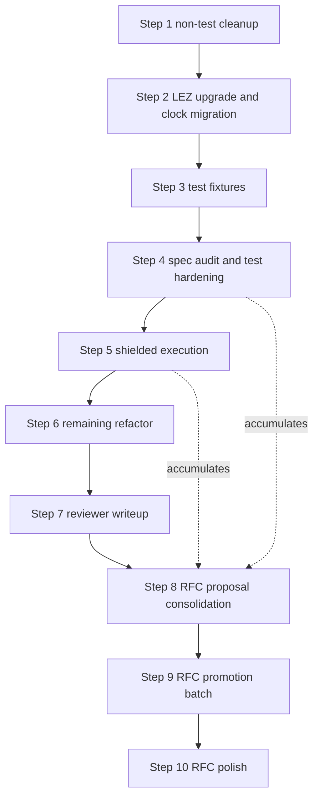

# Payment Streams on LEZ - Implementation Plan

This plan covers the SPEL-based LEZ implementation
for payment streams,
as defined in
`rfc-index/docs/ift-ts/raw/payment-streams.md`.

Implementation decisions are tracked in
`lez-payment-streams/design.md`.
RFC promotion is deferred
until decisions are stable.

## Scope

- Production implementation repository.
- Includes account model,
instruction handlers,
validation rules,
and tests.
- Vault semantics are single-token (native).
- Off-chain protocol work is out of scope.

## References

- `rfc-index/docs/ift-ts/raw/payment-streams.md` — protocol semantics.
- `lez-payment-streams/design.md` — implementation decision log.
- logos-execution-zone PR 403 `https://github.com/logos-blockchain/logos-execution-zone/pull/403` — system clock accounts.
- `spel/` — SPEL framework and macros.
- `lez-book/` — LEZ Development Guide (mdBook).

## Plan Execution Policy

Before editing the active implementation step,
record or update relevant implementation decisions in
`lez-payment-streams/design.md`.
Only the active step should receive concrete amendments.
Promote decisions to
`rfc-index/docs/ift-ts/raw/payment-streams.md`
in explicit batches.
Multi-token support is a future extension.

## Testing Approach

Use in-process `V03State` tests
with a TDD loop:
start with failing tests,
implement,
rerun to green.
That workflow does not depend on a particular `cargo test` filter
or a separate test binary.

Primary local loop:

- `RISC0_DEV_MODE=1 cargo test -p lez_payment_streams_core --lib`

Optional: add a `program_tests` filter
(`… --lib program_tests`)
to match only tests under that module
when you want a slightly faster iteration
and are not touching other unit tests.

After changes to the guest
or to shared types the guest uses,
rebuild the guest ELF before relying on test results,
for example
`cargo risczero build --manifest-path methods/guest/Cargo.toml`
or
`cargo build -p lez_payment_streams-methods`.

Keep Borsh guest-safe:
on guest, avoid `#[derive(BorshSerialize, BorshDeserialize)]`—
use manual serialization.
Shared types are guest-relevant,
so direct derive-based Borsh in shared code isn't expected.

## Code Placement in SPEL Repository

- `methods/guest/src/bin/lez_payment_streams.rs`
  contains the `#[lez_program]` module,
  `#[instruction]` handlers,
  account attributes,
  and thin dispatch glue.
- `lez_payment_streams_core/src/lib.rs`
  is the shared types and pure-logic boundary
  for both guest and host code.
  Keep `VaultConfig`, `VaultHolding`, `StreamConfig`,
  shared enums, instruction payload types,
  and pure helpers here.
  Avoid guest runtime or account I/O here.
- `methods/src/lib.rs`
  remains generated-methods glue
  and should stay minimal.
- `lez_payment_streams_core/src/program_tests/`
  contains guest-backed `V03State` tests
  (submodules per instruction, plus `serialization` and `common` helpers).
- `lez_payment_streams_core/src/test_helpers.rs`
  contains reusable test harness helpers
  for keypairs,
  state setup,
  guest deployment,
  and transaction builders.

Negative-case tests use a `*_fails` suffix
when the name alone would be ambiguous
(for example `test_withdraw_exceeds_unallocated_fails`).

## Completed Work

Reference summary of work already landed.
Decision bullets for each item are recorded in `design.md`.

- SPEL scaffold and vault baseline:
  `VaultConfig` and `VaultHolding` payloads with manual `to_bytes` / `from_bytes`,
  `initialize_vault` handler with PDA-derived vault accounts.
- Deposit and withdraw:
  `deposit` and `withdraw` handlers,
  unallocated-balance rule (`vault_holding.balance - total_allocated`),
  owner authorization.
- Stream creation:
  `StreamConfig` payload,
  `create_stream` handler with stream PDA,
  stream id assignment policy.
- Timestamp and accrual:
  mock timestamp account,
  lazy accrual via `StreamConfig::at_time` in shared core,
  `sync_stream` handler,
  `StreamConfig::validate_invariants`,
  pause-on-depletion,
  depletion-instant handling for `accrued_as_of`.
- Pause, resume, top-up handlers with legal-transition enforcement.
- Close stream with unaccrued return.
- Claim with state-dependent semantics.
- Systematic negative tests and invariants:
  wrong caller, invalid transitions, overflow or underflow,
  operations on non-existent accounts.

## Plan

Numbered steps below replace the remaining work.
Steps are listed in execution order.

### Ordering overview

### 1. Non-test cleanup

Mechanical, low-risk, preserves external surface.
Touches core and guest only.

- `cargo fmt --all`.
- `cargo clippy --workspace --all-targets`,
  apply only mechanical fixes
  (unused imports, needless clones, redundant closures).
- Extract the repeated prologue in
  `methods/guest/src/bin/lez_payment_streams.rs`
  shared by `close_stream`, `claim`, and `top_up_stream`.
  Shape: two or three variants keyed on auth rule
  (owner-signed, authority-signed, provider-signed),
  reusing or generalizing the existing `load_vault_stream_and_clock`.
- Add a small post-state constructor helper
  (for example `states_only_5(vault_config, holding, stream, signer, clock)`).

Do not touch in this step:
public names on `VaultConfig`, `VaultHolding`, `StreamConfig`, `Instruction`, `ERR_*`;
core math signatures
(`at_time`, `close_at_time`, `claim_at_time`, `resume_from_paused_at`, `validate_invariants`);
module boundaries;
`assert_execution_failed_with_code` semantics.

### 2. LEZ upgrade and clock migration

Retire `lez_payment_streams_core/src/mock_timestamp.rs`
and all `MockTimestamp` references
in favor of the system clock accounts from
logos-execution-zone PR 403
(`CLOCK_01`, `CLOCK_10`, `CLOCK_50`; 16-byte `(block_id, timestamp)` payload).

Decision log updates in `design.md`:

- system clock accounts supersede `MockTimestamp`
- clock granularity policy (guest accepts any of the three; client picks)
- retirement of `ERR_INVALID_MOCK_TIMESTAMP` and `SEED_MOCK_CLOCK`
- private-proof invalidation rationale for coarser clocks

#### 2.1 Upgrade LEZ dependency and verify system clock

- Bump the LEZ, NSSA, and SPEL dependencies in
  `lez-payment-streams/Cargo.toml`
  to a revision that includes PR 403 merged.
- Verify in the resolved version:
  - `V03State::new_with_genesis_accounts` seeds the three clock accounts.
  - `CLOCK_01_ID`, `CLOCK_10_ID`, `CLOCK_50_ID` (or equivalents)
    are exported and reachable from guest and host.
  - The clock program id is reachable for ownership checks.
- Smoke test: existing suite still passes after the bump
  (build the guest, then run
  `RISC0_DEV_MODE=1 cargo test -p lez_payment_streams_core --lib`).
  Fix any upstream breakage in isolation before starting the rest of the migration.

#### 2.2 Guest and core changes

- Delete `MockTimestamp` or shrink it to a test-only payload constructor
  (`fn clock_payload(block_id: u64, timestamp: u64) -> Vec<u8>`).
- In `methods/guest/src/bin/lez_payment_streams.rs`,
  replace `parse_mock_timestamp` with `parse_clock_account`
  that reads the 16-byte `(block_id, timestamp)` layout
  and returns the `timestamp` as `Timestamp`.
- Add clock identity validation inside `parse_clock_account`.
  Pick one of:
  - owner check against the clock program id
    (`account.program_owner == CLOCK_PROGRAM_ID`), or
  - allowlist against the three system clock account ids.
  Emit a new error code `ERR_INVALID_CLOCK_ACCOUNT`
  (append after 6025; do not renumber existing codes).
- Retire `ERR_INVALID_MOCK_TIMESTAMP` (6011).
  Leave the constant reserved and unused.
- `StreamConfig::at_time` and the other math in
  `lez_payment_streams_core/src/stream_config.rs`
  stay unchanged.
- Do not alter `Instruction` variants in this step.
  Client chooses clock granularity
  by which clock account id it includes in `account_ids`.

#### 2.3 Test harness changes

- Replace `force_mock_timestamp_account` in
  `lez_payment_streams_core/src/test_helpers.rs`
  with `force_clock_account(state, clock_id, block_id, timestamp)` that:
  - writes the 16-byte payload,
  - sets `program_owner` to the clock program id
    so the guest identity check passes.
- In `lez_payment_streams_core/src/harness_seeds.rs`,
  retire `SEED_MOCK_CLOCK`
  and add constants or helpers that surface
  the three system clock account ids.
- Update `lez_payment_streams_core/src/program_tests/common.rs`
  fixtures (`state_deposited_with_mock_clock*`)
  to take a clock account id from the system clocks,
  not a keypair-derived id.
- Update every test that references `mock_clock_account_id`
  to use the chosen system clock id.

#### 2.4 Design doc and proposal list updates

- In `design.md`,
  replace the "placeholder timestamp source account" paragraph under Data types
  with a section describing the system clock accounts,
  the 16-byte layout,
  granularity trade-offs,
  and the guest-side identity check.
- Add entries to the RFC-proposal list (seed for step 8):
  replace "mock timestamp source" wording with system clocks;
  document the granularity trade-off
  in Security and Privacy Considerations.

### 3. Test fixture extraction

Runs over migrated code so helpers are keyed on the new clock reality.

- Introduce a `VaultFixture` struct returned by `state_with_initialized_vault*`
  (replacing the 7-tuple destructuring) with fields
  `state`, `program_id`, `owner_key`, `owner_id`,
  `vault_id`, `vault_config`, `vault_holding`.
  Add `provider` and `clock_id` where fixtures provide them.
- Add a scenario builder for
  "vault initialized, deposit made, clock set, stream created,
  clock advanced, synced at `t1`".
  The three tests in
  `lez_payment_streams_core/src/program_tests/claim.rs`
  collapse down to the differing tail after this helper lands.
- Generalize `first_stream_accounts` so it builds `StreamIxAccounts`
  directly from a `VaultFixture` plus stream PDA.
- Consolidate per-test constants (`allocation`, `rate`, `t0`, `t1`)
  that three or more tests in the same module share,
  promoted to module-level `const`s.
- Sort and deduplicate `use` blocks across test modules.

### 4. Spec audit and test hardening

Walk `rfc-index/docs/ift-ts/raw/payment-streams.md`
and `design.md` against the code.
Produce a running three-bucket list during the audit:

1. missing or weak tests (add in place),
2. behavior gaps (fix in place, minimal change),
3. RFC-proposal candidates (append to the step 8 list).

Specific items to check that are not fully covered today:

- Solvency and conservation invariants as scenario tests:
  `vault_holding.balance >= vault_config.total_allocated` and
  `total_allocated == Σ stream.allocation` after arbitrary legal sequences.
- Arithmetic boundaries at `u128::MAX`, `u64::MAX`, `Timestamp::MAX`,
  `next_stream_id` overflow, `total_allocated` overflow,
  stream `allocation` overflow on top-up.
- Authorization matrix: one wrong-signer negative case per instruction.
  Consider a parameterized module.
- `sync_stream` edge cases:
  `now == accrued_as_of` is a no-op fold;
  depletion via sync;
  time regression fails.
- Withdraw recipient existence precondition,
  parallel to the documented provider-account precondition on claim.
- Deterministic PDA derivation test that asserts the host helper
  in `lez_payment_streams_core/src/test_helpers.rs`
  matches the guest `#[account(pda = [...])]` seed declarations.
- Clock harness hygiene:
  monotonic-by-default helpers
  and an explicit escape hatch for negative tests,
  forward from the earlier mock-clock follow-up,
  now keyed on the system clock.

### 5. Shielded execution tests

Add shielded-mode tests that run representative flows through
`execute_and_prove`
and `transition_from_privacy_preserving_transaction`.
No new program logic.
If anything fails, fix under the existing structure;
do not restructure during this step.

Benefits from step 2 because the system clock
matches the private-proof invalidation model that PR 403 was designed around.

Decision log updates in `design.md`:

- public and shielded parity assumptions
- timestamp constraints in private flow
  (clock granularity choice per instruction)

### 6. Remaining refactor

With public and shielded suites green,
reshape where audit findings and reviewer perspective now justify it.

Candidates not resolved in steps 1 or 3:

- Collapse contextual `spel_custom(code, "message")` call sites via a small helper
  (design informed by the full call-site set after step 4).
- Decide `ERR_*` as `#[repr(u32)]` enum vs keep `u32` constants,
  gated on whether step 4 tests actually match on many codes.
- Any public-name renames on types or fields,
  applied in a single sweep together with the reviewer doc in step 7.
- Final `cargo fmt` and
  `cargo clippy --workspace --all-targets`
  sweep before handoff.

### 7. Reviewer-facing writeup

Replace or reshape `design.md`
into a reviewer-oriented document.
Suggested structure:

1. Component map (core, guest, methods glue).
2. Account model and PDA derivation, inline table.
3. Wire layouts per account (byte offsets), including the system clock.
4. Authorization matrix, instruction by signer.
5. Invariants and balance conservation.
6. Accrual semantics and depletion instant.
7. Error code table with call sites.
8. Testing guide (how to run, fixtures, seeds).
9. Divergences from the RFC, pointing to the step 8 proposal list.

### 8. RFC proposal consolidation

Clean the RFC-proposal list accumulated in steps 2 through 7.
Deliverable: a patch-ready diff against
`rfc-index/docs/ift-ts/raw/payment-streams.md`
plus a rationale paragraph per change.

Known seeds:

- `unallocated` terminology
  (replace any lingering "available balance" wording).
- `allocation` as current commitment (`accrued + unaccrued`).
- `resume` wording around `unaccrued`
  (resume requires `accrued < allocation`).
- Equivalence criterion: streams match when
  `allocation`, `accrued`, `rate`, and `state` match,
  not when "original create amount" matches.
- Claim reduces `allocation` and `total_allocated` by the payout,
  not only `VaultHolding` balance and `accrued`.
- System clock replaces the mock timestamp source;
  granularity guidance added to Security and Privacy Considerations.

Do not edit the RFC in this step.

### 9. RFC promotion batch

Apply the consolidated patch from step 8 in one batch to
`rfc-index/docs/ift-ts/raw/payment-streams.md`.
This is the first step that edits the RFC.

Include:

- account model and PDA derivation
- instruction definitions
- validation and invariant rules
- time source (system clocks) and accrual behavior
- execution mode notes

### 10. RFC polish and review

Finalize Security and Privacy Considerations
and References in the RFC.
Review consistency across:
implemented behavior,
`design.md` (or its successor reviewer doc),
and RFC text.

## Cross-cutting Deliverables

Apply alongside the steps above, not as a dedicated phase.

- CI job that builds `lez_payment_streams-methods`
  before running `cargo test`
  so program tests never use a stale ELF.
- Documented `RISC0_DEV_MODE` policy for CI versus local runs.
- Decision whether to tighten `assert_execution_failed_with_code`
  to typed errors once the host exposes them.

## Out of Scope

- Off-chain protocol
  VaultProof, StreamProof, eligibility proofs, service messaging.
- Integration with a running sequencer for end-to-end demo.
- Multiple tokens per vault (or per vault holding).
- Future token extension path is out of scope.
- Protocol extensions
  auto-pause, delivery receipts, activation fee, auto-claim.
